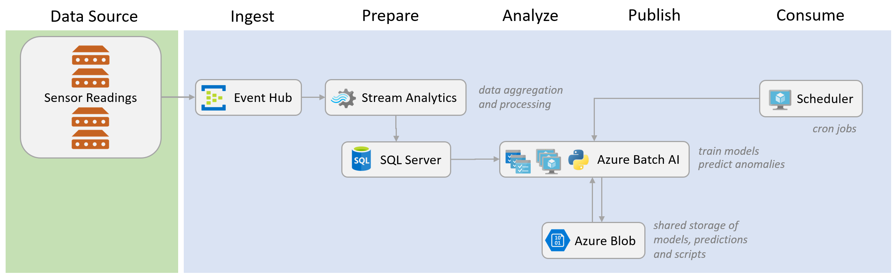

# End-to-End Anomaly Detection Jobs using Azure Batch AI
In this walkthrough I show how an end-to-end anomaly detection system can be implemented for IoT use cases. The scenario is intentionally kept simple for illustration purposes and to allow generalizing to different scenarios in industry. 

The solution is built on Microsoft's Azure stack and includes multiple cloud services that allow handling data streaming, data processing, model training/predicting, and data storage. The main component here is Batch AI, a cloud service that enables users to submit parallel jobs to a cluster of high performing virtual machines.

The business problem addressed in this walkthrough is: monitoring sensor measurements of multiple devices and predicting potential anomalies that might lead to failures across these devices. A typical example of this is as follows:

 A manufacturing plant has sensors attached to its machines. The collected measurements are used to build machine learning models that can be used to predict whether a machine or a component would fail at some point in the future.

Parallelization is key here as we would like to build many models concurrently, one for each sensor and on a regular basis. The diagram below shows the overall solution architecture.


<p style="text-align: center;">Solution Architecture</p>


## Prerequisites
The solution requires setting up a number of cloud resources before building the pipeline. For convenience, these resources can be grouped under the same [resource group](https://docs.microsoft.com/en-us/azure/azure-resource-manager/resource-group-portal). You can follow the links below for more information on how to create these services. The simplest way is by using the [Azure Portal](https://portal.azure.com/), or alteratively, using the [Azure CLI](https://github.com/Azure/azure-cli).

 - [Azure Event Hubs](https://azure.microsoft.com/en-us/services/event-hubs/)
 - [Azure Stream Analytics](https://azure.microsoft.com/en-us/services/stream-analytics/)
 - [Azure SQL Database](https://azure.microsoft.com/en-us/services/sql-database/)
 - [Azure Blob](https://azure.microsoft.com/en-us/services/storage/blobs/)
 - [Azure Batch AI](https://azure.microsoft.com/en-us/services/batch-ai/)


## Data Processing
In this section, I describe the data simulation, data ingestion, and aggregation components. 

### Event Hubs
Event Hubs is a cloud-based data ingestion service. It is the first interface to the pipeline and allows streaming in the measurements. All that is required in this step is to create the service and an Event Hub under that with a specific name. The connection string of that endpoint can be found in the *Overview* section in Azure Portal. It should look like the following:

    Endpoint=sb://[namespace].servicebus.windows.net/;SharedAccessKeyName=RootManageSharedAccessKey;SharedAccessKey=[key];EntityPath=[eventhubname]

Note that I've added the *EntityPath* property at the end of the connection string to specify the Event Hub name. This endpoint is referenced in the data simulation app described in the following section.

### Data Simulation
Now that Event Hubs is running and listening to incoming data, you can generate sensor-like data through a data simulator app and send it to Event Hubs using one of the available SDKs. I've created a console C# app that generates random sensor values for 3 imaginary devices, where each device has 5 attached sensors. Each value is represented as a JSON message that contains a timestamp, a device ID, a tag ID (this is typically a sensor identifier), and a value (this could be the temperature, pressure, or any measurement of interest collected by a sensor):

```json
{
    "TS": "2018-04-06T20: 59: 55.7096564Z",
    "Device": 2,
    "Tag": 4,
    "Value": 84.92
}
```
The source code of the app can be found [here](data_simulator/Program.cs). The app uses the Azure C# SDK to send the messages to Event Hubs asynchronously:

```CSharp
using Microsoft.Azure.EventHubs;
``` 

```CSharp
await eventHubClient.SendAsync(new EventData(Encoding.UTF8.GetBytes(message)));
``` 

### Stream Analytics
In most cases, you would want to process the incoming streams of data and apply some aggregations, filtering, or feature selection, before building a model. This is particularly useful when the data is ingested at a very high frequency and an aggregated view is more useful for the application at hand, or when you need to perform moving windows operations on time series. 

To do so, you can create an Azure Stream Analytics (ASA) service in the portal, specify the name, input, query and output. The input is simply the Event Hub we created. The query is a SQL-like command that applies the aggregation and/or filtering to the incoming stream of data. In this example, I compute the average value of a sensor measurement within tumbling windows of 5 seconds:

```SQL
SELECT
    System.TimeStamp AS TS,
    Device AS Device,
    Tag AS Tag,
    AVG(Value) AS [Value]
INTO
    [sqloutput]
FROM
    [ehinput]
GROUP BY
    Device,
    Tag,
    TumblingWindow(second, 5)
```

### SQL Database
The output of the ASA query can be redirected to some storage service. You can see the supported options in the portal when you create the output for the Stream Analytics job. For convenience, I use an Azure SQL Database instance, where I've created a table, named *SensorValues* with the schema shown below to store the processed results, and set the ASA output to that table:

```SQL
CREATE TABLE [SensorValues] 
(
    [TS]     DATETIME   NOT NULL,
    [Device] INT        NOT NULL,
    [Tag]    INT        NOT NULL,
    [Value]  FLOAT      NOT NULL
)
```
Once the ASA job is started, you can look into the *SensorValues* table and verify that data is accumulating there. This is the data we will use for training the anomaly detection models and for making predictions as well.

## Blob Storage
Before we move on to the next steps, we need to create a blob storage service with two containers to store the outputs of the training and prediction jobs. We will also use these containers to store the Python training and prediction scripts. Note that these containers will be shared across the nodes of the Batch AI cluster, in the form of filesystem mounts. This allows the virtual machines to read and write concurrently during the execution of the parallel jobs. I've named my containers *models* and *predictions* and saved the blob account name and key so that I can reference them later in the scripts (these can be found in the *Access keys* section of the storage account service through the portal).  

## Training
Given that we don't have explicit labels of anomalies in this scenario, as in many real-world scenarios, but rather a continuous stream of measurements, we will choose an unsupervised method to model normal behavior of sensors. In particular, we will use [One-class SVMs](http://scikit-learn.org/stable/modules/generated/sklearn.svm.OneClassSVM.html) which can learn a decision function around normal data points and can predict anomalies that are significantly different from the expected values. 

As I mentioned before, the main goal of this example is to be able to train many models concurrently on a cluster of virtual machines. This can be achieved by running simultaneous jobs in an embarrassingly parallel fashion, where each job builds a model for one sensor, given some training data. I've created a simple Python [script](model/train.py) that takes as input the sensor identifiers (device ID and tag) and a time range for which the training data will be queried. 

```python
device = sys.argv[1]
tag = sys.argv[2]
ts_from = sys.argv[3]
ts_to = sys.argv[4]
```

The script also reads in a config file that contains the SQL Database connection string that I connect to through the *pyodbc* package, and the blob storage account info to be used for storing the trained models, using the *azure* package.  

```python
config_file = sys.argv[5]
with open(config_file) as f:
    j = json.loads(f.read())

sql_con_string = j['sql_con_string']
sql_query = j['sql_query']
blob_account = j['blob_account']
blob_key = j['blob_key']
blob_container = j['blob_container']
```

The following code snippet normalizes the data, trains a *scikit-learn* *OneClassSVM* model and saves the serialized training pipeline into blob storage:

```python
# train model
sc = StandardScaler()
clf = OneClassSVM(nu=0.0001, kernel='rbf', gamma=0.01)
pipe = Pipeline(steps=[('scaler', sc), ('classifier', clf)])
pipe.fit(vals.reshape(-1, 1))

# save model
blob_service = BlockBlobService(account_name=blob_account, account_key=blob_key)
blob_service.create_blob_from_bytes( blob_container, model_name, pickle.dumps(pipe))
```

## Making Predictions
Similarly, I've created a prediction [script](model/predict.py) that loads a trained model for a given sensor, retrieves the data values of a given time range, makes predictions, and stores them in CSV format on blob storage.  

```python
# load model
blob_service = BlockBlobService(account_name=blob_account, account_key=blob_key)
blob = blob_service.get_blob_to_bytes(models_blob_container, model_name)
pipe = pickle.loads(blob.content)

# predict
preds = pipe.predict(vals.reshape(-1, 1))
preds = np.where(preds == 1, 0, 1) # 1 indicates an anomaly, 0 otherwise

# csv results
res = pd.DataFrame({'TS': tss,
                    'Device': np.repeat(device, len(preds)),
                    'Tag': np.repeat(tag, len(preds)),
                    'Val': vals,
                    'Prediction': preds})
res = res[['TS','Device','Tag','Val','Prediction']]

res_file_name = 'preds_{0}_{1}_{2}_{3}'.format(device,
                                               tag,
                                               ts_from.replace('-',''),
                                               ts_to.replace('-',''))

# save predictions
blob_service = BlockBlobService(account_name=blob_account, account_key=blob_key)
blob_service.create_blob_from_text(predictions_blob_container, res_file_name, res.to_csv(index=None))
```

## Creating Parallel Jobs
Now that we have the training and predicting scripts ready, we can create multiple Batch AI jobs to execute those scripts concurrently for many sensors. Batch AI is an Azure cloud service that allows creating a cluster of virtual machine nodes and running async jobs on those machines in parallel. Batch AI also supports distributed training using popular deep learning tool kits, such as CNTK and Tensorflow, where a single model can be trained across multiple nodes. For this example, I use custom jobs, where each job executes a Python script with a specific set of arguments. I've used the Azure CLI to create the Batch AI service (this can also be done through the portal):

```
az login
az account set -s "mysubscription"
az batchai cluster create -l eastus -g myresourcegroup -n myclustername -s Standard_NC6 -i UbuntuDSVM --min 2 --max 2 -u myuser -p mypass --storage-account-name mystoragename --storage-account-key mystoragekey --container-name myblobcontainer 
az batchai cluster show -g myresourcegroup -n myclustername
```

Notice, from the commands above, that the cluster is made up of 2 Ubuntu [Data Science Virtual Machines](https://azure.microsoft.com/en-us/services/virtual-machines/data-science-virtual-machines/) and that I've provided the blob account to be used as shared storage across the nodes (as filesystem mounts). The blob containers will be used to store the Python scripts, the serialized models and the predictions. To submit jobs, I've created another Python [script](batchai/submit_jobs.py) that logs in to the Batch AI service, creates a client and executes a command line program on one of the nodes. The script sends all the jobs at once to the cluster, where Batch AI manages the concurrent execution across the nodes. The same script can be used for both training and predicting by setting the command line argument in a config file. For example, to execute the training script created earlier, the command line string would be:

```sh
"python /mnt/batch/tasks/shared/LS_root/mounts/bfs/train.py 2 3 2018-03-01 2018-03-02 /mnt/batch/tasks/shared/LS_root/mounts/bfs/train_config.json"
```

This command trains a model for the sensor with "device ID"=2, "tag"=3 and values collected between 2018-03-01 and 2018-03-02. The *train_config.json* file has the input and output connections' details. The mount path, used here to locate the Python script and the config file, refers to the blob storage container that was specified when creating the Batch AI cluster and is mapped to the filesystem mount on the nodes. Note that these files have to be placed in the container before submitting a job.

The main steps of the job submission script are shown below. I read the lists of devices and tags from the config file and submit a job for each pair (these identify a specific sensor).

```python
config_file = sys.argv[3]
with open(config_file) as f:
    j = json.loads(f.read())

# Azure service principle login credentials
TENANT_ID = j['TENANT_ID']
CLIENT = j['CLIENT']
KEY = j['KEY']

# Batch AI cluster info
resource_group_name = j['resource_group_name']
subscription_id = str(j['subscription_id'])
cluster_name = j['cluster_name']
location = j['location']
command_line = j['command_line']
std_out_err_path_prefix = j['std_out_err_path_prefix']
config_file_path = j['config_file_path']
node_count = j['node_count']

# job parameters
ts_from = sys.argv[1]
ts_to = sys.argv[2]
device_ids = j['device_ids']
tags = j['tags']
job_name_template = j['job_name']

credentials = ServicePrincipalCredentials(
    client_id=CLIENT,
    secret=KEY,
    tenant=TENANT_ID
)

batchai_client = batchai.BatchAIManagementClient(
    credentials=credentials, subscription_id=subscription_id)
cluster = batchai_client.clusters.get(resource_group_name, cluster_name)

# run an async job for each sensor
for device_id in device_ids:
    for tag in tags:
        job_name = job_name_template.format(device_id, tag)
        custom_settings = baimodels.CustomToolkitSettings(command_line=command_line.format(device_id, tag, ts_from, ts_to, config_file_path))
        print('command line: ' + custom_settings.command_line)
        params = baimodels.job_create_parameters.JobCreateParameters(location=location,
                                                                     cluster=baimodels.ResourceId(
                                                                         cluster.id),
                                                                     node_count=node_count,
                                                                     std_out_err_path_prefix=std_out_err_path_prefix,
                                                                     custom_toolkit_settings=custom_settings
                                                                     )

        batchai_client.jobs.create(resource_group_name, job_name, params)
```

To submit a prediction job, we can use the same script with a similar [config file](batchai/bai_pred_config.json) that specifies a different command line (to execute the predictions Python script):

```
python /mnt/batch/tasks/shared/LS_root/mounts/bfs/predict.py {0} {1} {2} {3} {4}
```

## Scheduling Jobs

For continuous execution of Batch AI jobs on a regular schedule, one can simply use a system task scheduler such as *cron jobs* to run parameterized shell scripts. 

In our anomaly detection scenario, we might want to train models and make predictions for all sensors every day or every hour. For example, the following [shell script](scheduler/train.sh) (*train.sh*) can be used on a linux machine (a local server, or a virtual machine) to submit jobs for models listed in the config file. The models would be trained on data collected within the past hour:

```sh
#!/bin/bash

ts_from="$(date --date="1 hour ago" +"%Y-%m-%d %H:%M")"
ts_to="$(date +"%Y-%m-%d %H:%M")"

python submit_jobs.py "\"$ts_from\"" "\"$ts_to\"" /home/scheduser/bai_train_config.json
```

Similarly, you can create a shell [script](scheduler/pred.sh) for making predictions and a cleanup [script](scheduler/cleanup.sh) to delete the Batch AI jobs that have finished running. The scripts, along with their config files, need to be stored on the scheduler machine, which must have Python and the *azure* package installed.

Note that at the time of writing this document, a Batch AI job needed to be deleted manually before submitting a new job with the same name. 

The scripts can be automated through [cron jobs](https://help.ubuntu.com/community/CronHowto) by creating the following lines in a crontab [file](scheduler/cron.txt) and adding that file to the scheduler using the *crontab* command. These cron jobs would perform training, predicting, and cleanup every hour at minutes 0, 20, and 40 respectively.

```sh
0 */1 * * * . /home/scheduser/train.sh
20 */1 * * * . /home/scheduser/predict.sh
40 */1 * * * . /home/scheduser/cleanup.sh
```

```sh
crontab cron.txt
```


## Links

- https://docs.microsoft.com/en-us/azure/batch-ai/
- https://github.com/Azure/BatchAI


